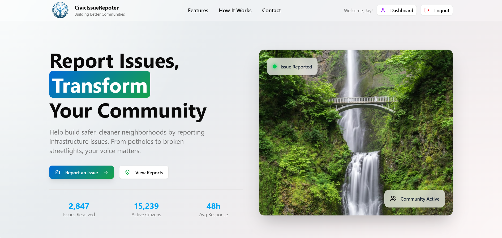
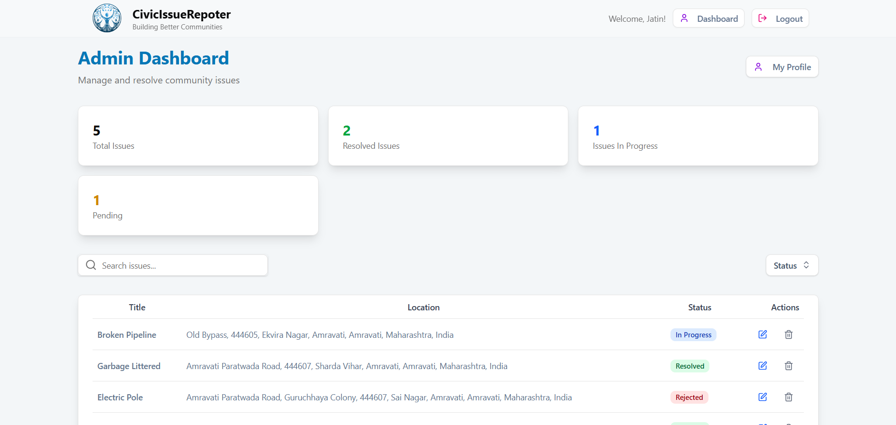
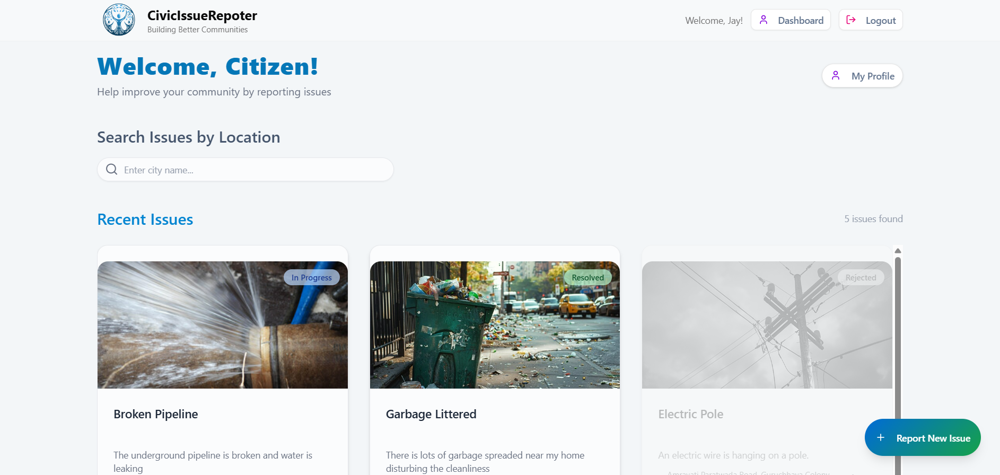
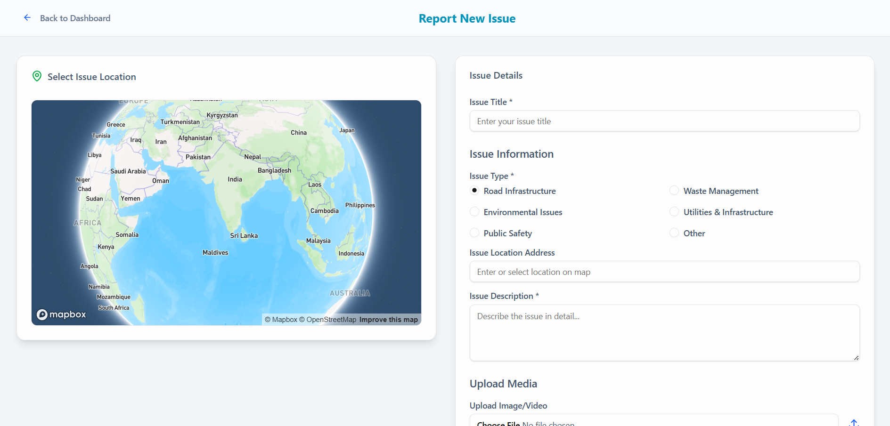

# 🏙️ Civic Issue Reporter

A real-time, full-stack civic issue management platform designed to improve local governance by empowering citizens to report issues and enabling authorities to resolve them efficiently. This application supports photo uploads, status tracking, geotagging, and role-based access for admins and citizens.

---

## 🔗 Live Demo

Check out the deployed application here:  
👉 [https://civic-issue-reporter-application.vercel.app/]

---

## 📸 Preview

### LandingPage View


### Admin View


### Citizen View


### Report an Issue View


---

## ✨ Features

### 👤 Citizen Features
- Secure sign-up and login using JWT.
- Create and submit issues with:
  - Title, description, location, and category.
  - Multimedia support (image uploads).
- Track issue status in real-time.
- Delete only user-submitted issues.
  
### 🛡️ Admin Features
- View all reported issues.
- Update issue status (Reported → In Progress → Resolved).
- Delete any issue in the system.
- Access filtered or categorized issue data.

### 🔧 System Features
- Fully responsive UI with Tailwind CSS & Framer Motion animations.
- Zod-based form validations on frontend and backend.
- Secure API routes.
- Cloudinary integration for storing uploaded media.
- MongoDB with Mongoose for scalable data management.
- Clean file structure and reusable components.

---

## 🛠️ Tech Stack

| Frontend     | Backend       | Database | Utilities            | Dev Tools             |
|--------------|----------------|----------|-----------------------|------------------------|
| React        | Node.js        | MongoDB  | JWT (Auth)            | Vite                   |
| TypeScript   | Express.js     | Mongoose | Zod (Validation)      | Shadcn UI Components   |
| Tailwind CSS |                |          | Cloudinary (Uploads)  | Framer Motion          |

---

## ⚙️ Installation & Setup

1. **Clone the repository**
   ```bash
   git clone https://github.com/your-username/Civic-issue-reporter-application.git
   cd Civic-issue-reporter-application

2. **Frontend Setup**
   ```bash
   cd frontend
   npm install
   npm run dev
   
3. **Backend Setup**
   ```bash
   cd backend
   npm install
   npm run dev
   
4. **Environment Variables**
   Create .env files in both frontend and backend directories.
   ##Backend .env example:
   ```bash
   DATABASE_URL=your_mongodb_connection_string
   JWT_PASSWORD=your_jwt_secret
   CLOUDINARY_CLOUD_NAME=your_cloudinary_cloud_name
   CLOUDINARY_API_KEY=your_api_key
   CLOUDINARY_API_SECRET=your_api_secret
   CORS_ORIGIN=*
   PORT=5000

  ##Frontend .env example:
  ```bash
  VITE_MAPBOXGL_ACCESS_TOKEN=your_access_token


